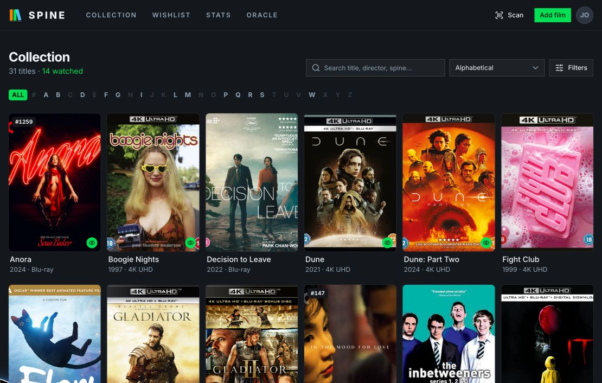
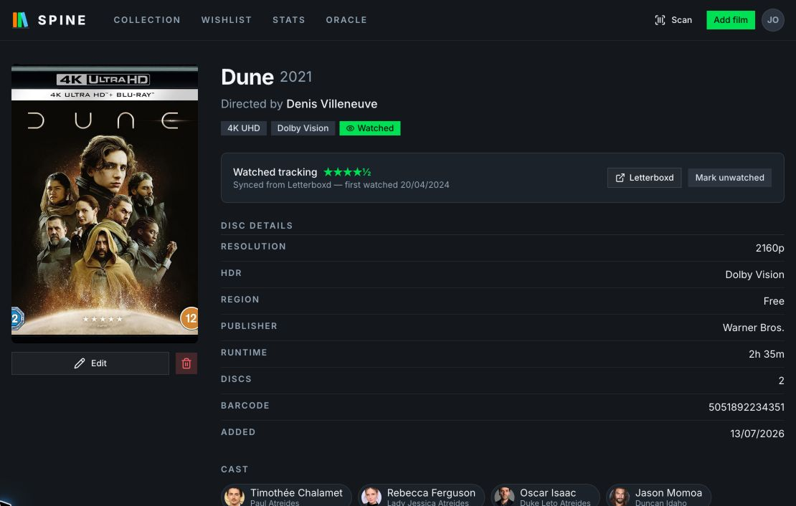
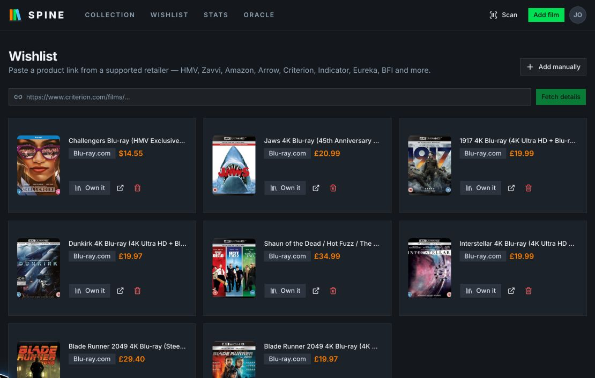
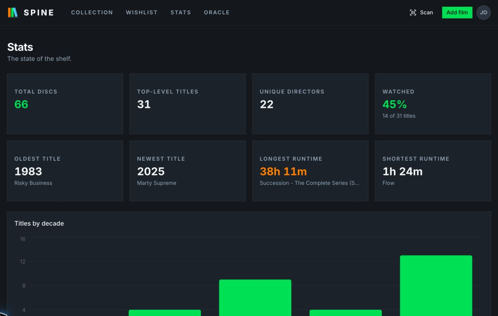
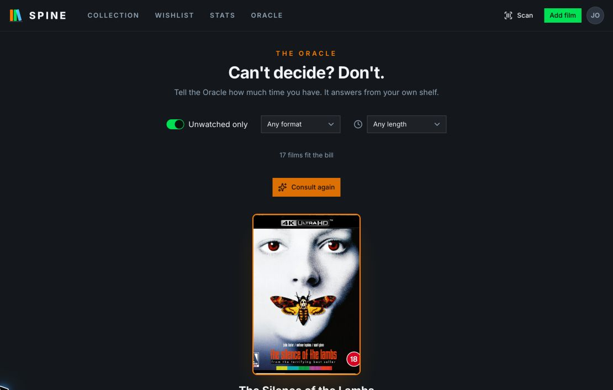
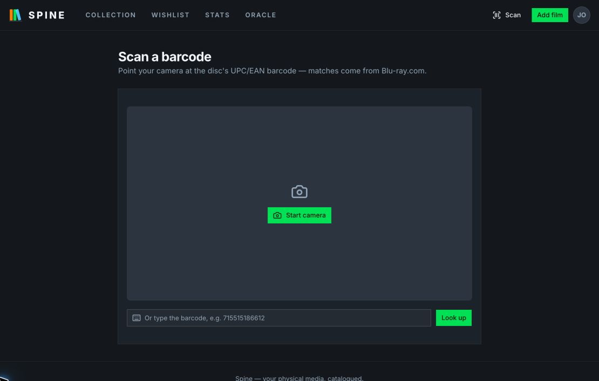
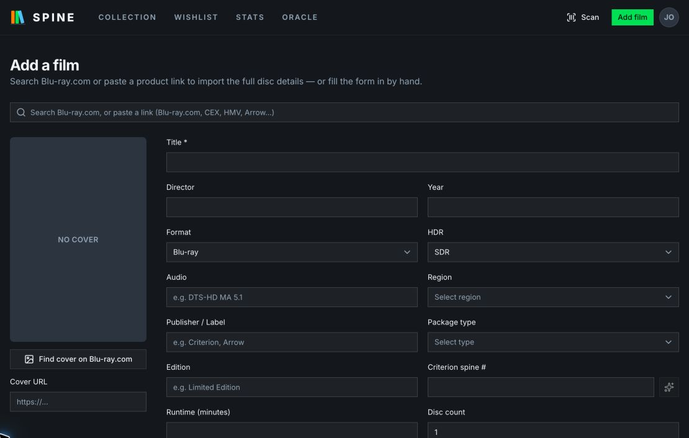

<div align="center">
  
  <h1>Spine</h1>
  <p><strong>Your physical media, catalogued.</strong></p>
  <p>A Letterboxd-inspired, self-hosted collection tracker for Blu-ray, 4K UHD, and DVD.</p>
</div>

<p align="center">
  
</p>

<p align="center"><sub>Search, filter, and browse your shelf by title, format, or Criterion spine number.</sub></p>

## Features

- 🎬 Rich metadata per disc: director, year, format, audio, HDR, region, publisher, package type, edition, runtime, disc count, barcode
- 🔍 Search and browse by title, alphabetically (A–Z rail), or by Criterion spine number
- 📊 Stats: total discs, titles, unique directors, watched %, titles by decade, oldest/newest, longest/shortest runtime, top directors, resolution, publisher × package type, region, media type
- 👁️ Watched tracking auto-synced from your Letterboxd RSS feed (first-time watches only; rewatches ignored) with a manual per-title override
- 🎯 Wishlist with retailer URL scraping (Firecrawl) — HMV, Zavvi, Amazon, Arrow, Criterion, Indicator, Eureka, Second Sight, 88 Films, BFI, Terracotta, Munday Monday, Vinegar Syndrome, Imprint, Kino Lorber, Shout Factory, Blu-ray.com
- 🔮 The Oracle — random picker with unwatched/format filters and a "how much time do I have" runtime limit
- 🖼️ Cover art and barcode lookup via Blu-ray.com quicksearch
- 📷 Camera barcode scanning (UPC/EAN) to add discs
- ⚡ Add by search or link — autocomplete against Blu-ray.com or paste a product URL; imports title, year, director, format, audio, HDR, region, publisher, spine #, runtime, disc count, and cover in one go
- 🎭 TMDB cast enrichment — cast fetched automatically on add (movies and TV), shown on each film page, with a "Top actors" leaderboard in Stats (requires `TMDB_API_KEY`)
- 👤 Person pages — click any actor or director anywhere to see everything of theirs in your collection, directing and acting credits on one page
- 🏛️ Auto Criterion spine numbers — matched against criterion.com's release list on add and via a Settings backfill
- 🔐 better-auth email/password + real Postgres row-level security

## See it in action

### Rich title details

Keep technical disc metadata, cast, watched state, and Letterboxd activity together on one page.



### A wishlist that does the data entry

Paste a supported retailer or Blu-ray.com URL to fetch release details, track prices, and move purchases into the collection.



### Shelf analytics

See collection totals, watched progress, formats, regions, decades, runtimes, directors, actors, and publishers at a glance.



### The Oracle

Filter by watched state, format, and runtime, then let Spine choose tonight's film from your own shelf.



### Scan or import in seconds

<table>
  <tr>
    <td width="50%"></td>
    <td width="50%"></td>
  </tr>
  <tr>
    <td align="center"><strong>Camera or UPC/EAN lookup</strong></td>
    <td align="center"><strong>Search, paste a link, or add manually</strong></td>
  </tr>
</table>

## Stack

TanStack Start · TanStack Query · shadcn/ui (Base UI, base-lyra) · Tailwind v4 · Drizzle ORM · Postgres · better-auth · Bun

## Quick start with Docker

```bash
docker compose up --build
```

That's it — Postgres 18 starts with the RLS role, the schema is pushed and
policies applied on boot, and the app serves at http://localhost:3000.
Optional integrations are read from a `.env` file next to the compose file
(`FIRECRAWL_API_KEY`, `TMDB_API_KEY`); set `BETTER_AUTH_SECRET` for anything
beyond local use. Data persists in the `db-data` volume.

Hosting on a domain? Set two more variables in `.env`:

```bash
ALLOWED_HOSTS=spine.example.com   # or "*" behind your own reverse proxy
BETTER_AUTH_URL=https://spine.example.com
```

## Manual setup

1. Start Postgres and create the database + app role:

   ```bash
   createdb movie
   psql -d movie -c "CREATE ROLE movie_app LOGIN PASSWORD 'movie_app';
     GRANT CONNECT ON DATABASE movie TO movie_app;
     GRANT USAGE, CREATE ON SCHEMA public TO movie_app;
     ALTER DEFAULT PRIVILEGES IN SCHEMA public GRANT ALL ON TABLES TO movie_app;
     ALTER DEFAULT PRIVILEGES IN SCHEMA public GRANT ALL ON SEQUENCES TO movie_app;"
   ```

2. Copy/edit `.env` (defaults work for local dev). Set `FIRECRAWL_API_KEY`
   to enable wishlist URL scraping.

3. Push the schema, then apply the RLS policies:

   ```bash
   bunx drizzle-kit push
   psql -d movie -f drizzle/rls.sql   # re-run after every push
   ```

4. Run it:

   ```bash
   bun install
   bun run dev
   ```

Sign up at http://localhost:3000/signup, then set your Letterboxd username
under Settings to enable watched sync.

## Row-level security

The app connects as the non-superuser `movie_app` role. Every query runs
inside `withUser()` (`src/db/index.ts`), which sets `app.user_id` for the
transaction; the policies in `drizzle/rls.sql` scope all reads and writes on
`films`, `wishlist_items`, and `user_settings` to that user. Migrations run
as the table owner via `DATABASE_URL_ADMIN`.
